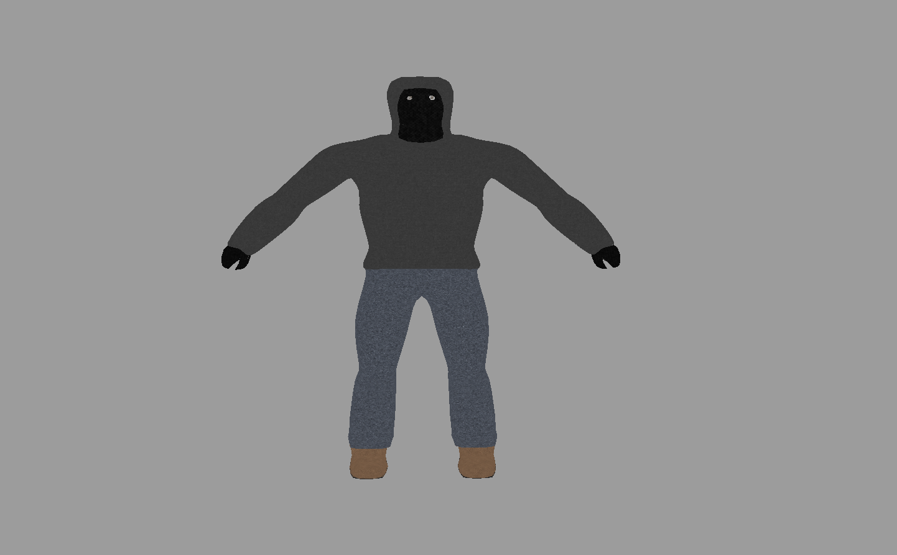
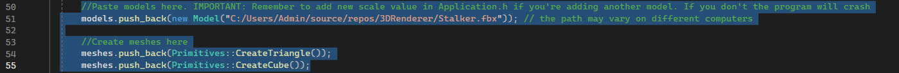

# 3D Renderer
A 3D renderer written in C++ using OpenGL, GLFW, GLAD, Assimp and stb_image.

## Features
- FBX/OBJ model importing
- Viewport camera with mouse look
- Texture support for imported models
- Primitive shapes (cube, triangle)

## Controls
| Key | Action |
|-----|--------|
| WASD | Move |
| Q / E | Up / Down |
| Left Shift | Sprint |
| Mouse | Look around |
| Escape | Exit |

## Dependencies
> Manual setup required before building.

| Library | Setup |
|---------|-------|
| GLFW | Add to Additional Include Directories and Library Directories |
| GLAD | Add `glad.c` to Source Files |
| GLM | Header only – add to Additional Include Directories |
| Assimp | `vcpkg install assimp` |
| stb_image | Included in project |

## Building
Built with **Visual Studio 2022** on Windows. Open `3DRenderer.sln` and build.

## Usage

### Importing a model

Add this line in `Application.cpp`:
```cpp
models.push_back(new Model("PathToYourModel"));
```
> The model must be triangulated. For textures, embed them in the `.fbx` on export.

### Creating primitives
```cpp
meshes.push_back(Primitives::CreateTriangle());
meshes.push_back(Primitives::CreateCube());
```

### Adjusting positions and scale
Edit the following vectors in `Application.h`:
```cpp
std::vector<glm::vec3> meshPositions = {
    glm::vec3(6.0f, 0.0f, 0.0f),
    glm::vec3(8.0f, 0.0f, 0.0f),
};

std::vector<glm::vec3> modelPositions = {
    glm::vec3(0.0f, 0.0f, 0.0f),
    glm::vec3(2.0f, 0.0f, 0.0f),
};

std::vector<float> modelScales = { 1.0f, 1.0f }; // one value per model
```